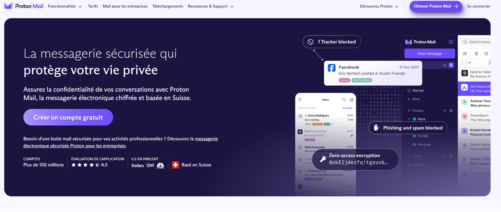
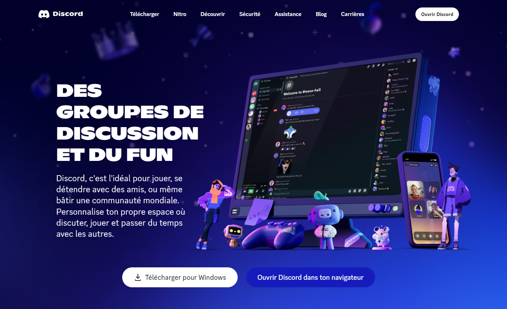
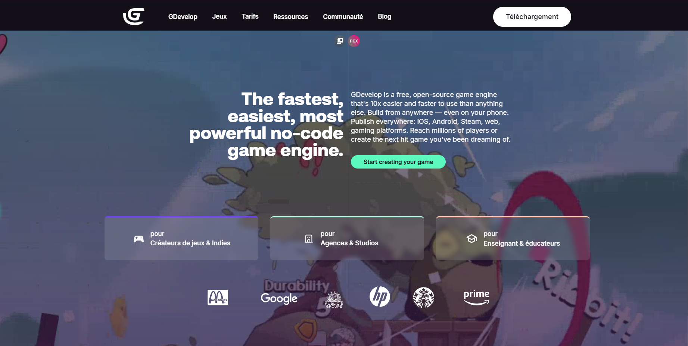

# 🎮 Cours : Création des Comptes pour CodeGaming 🎮
## Création d'une Adresse Email avec ProtonMail 📧
Une adresse email sans numéro de téléphone, c'est possible grâce à ProtonMail. Suivez ces étapes :

- 🔗 Accédez à ProtonMail : [Voici le lien.](https://proton.me/fr/mail)
- ✍️ Choisissez "S'inscrire" : Suivez les instructions à l'écran.
- ✔️ Sélectionnez le Plan "Gratuit" : Cela suffit pour ce que nous voulons faire.
- 🆔 Créez un nom d'utilisateur : Attention, c'est aussi votre adresse email.
- 🔒 Définissez votre Mot de Passe : Choisissez-en un sécurisé et que vous pouvez retenir.
- 📝 Notez vos Identifiants : Important ! Notez-les pour ne pas les oublier.

## Création d'un Compte Discord 🗨️
Créer un compte Discord est facile, mais attention à l'âge :

- 🔗 Rendez-vous sur Discord : [le lien vers Discord ici](https://discord.com)
- ✍️ Inscrivez-vous : Remplissez les champs requis.
- 🎂 Âge : N'indiquez pas votre vrai âge pour éviter les restrictions (au moins 18 ans).
- 🆔 Nom d'Utilisateur et Mot de Passe : Créez ceux que vous retiendrez facilement.
- 📧 Vérification Email : Confirmez votre compte via le lien dans l'email que vous recevrez.

## Création d'un Compte GDevelop 🎮
Pour commencer à créer vos jeux, un compte GDevelop est essentiel :

- 🔗 Visitez GDevelop : [le lien vers GDevelop ici](https://editor.gdevelop.io/?utm_campaign=try&utm_medium=website&utm_source=hero)
- ✍️ Cliquez sur "S'inscrire" : Remplissez les informations nécessaires.
- 📧 Email et Mot de Passe : Utilisez l'email ProtonMail que vous venez de créer.
- 📝 Notez Tout : Comme toujours, mettez vos identifiants en lieu sûr.

## 🔐 Conseils de Sécurité :
- 🛡️ Gardez vos identifiants et mots de passe en sécurité et accessibles seulement à vous. Utilisez des gestionnaires de mots de passe si nécessaire.
- 💡 Mémorisez-les ou notez-les dans un endroit sécurisé, comme un carnet personnel.

Avec ces comptes, vous serez prêt à plonger dans l'univers de CodeGaming ! Assurez-vous que tout est en ordre et n'hésitez pas à demander de l'aide si vous rencontrez des difficultés. 🚀

# 👋 Chers Parents

Nous souhaitons vous rassurer sur les activités que nous menons lors de notre session CodeGaming. 🎮 L'objectif principal de la création de ces comptes est purement pédagogique et centré sur la continuité de l'apprentissage à domicile.

## 🔍 Pourquoi ces comptes ?
- 🌐 ProtonMail : Permet à vos enfants de créer des comptes sur des logiciels tels que Discord et GDevelop. Cela leur offre la possibilité de récupérer leurs jeux et de continuer à travailler dessus chez eux grâce à la sauvegarde sur le cloud.
- 🗨️ Discord : Favorise une communication sécurisée au sein de notre communauté CodeGaming, tout en préservant leur vie privée.
- 🕹️ GDevelop : Encourage la créativité et l'innovation en leur permettant de développer leurs propres jeux, qu'ils peuvent peaufiner où qu'ils soient.

🛡️ Sécurité et Responsabilité : Nous guidons vos enfants dans la protection de leurs identifiants et garantissons une supervision adéquate pour assurer une expérience d'apprentissage sereine et sécurisé.

Votre soutien et votre compréhension sont précieux à nos côtés dans cette aventure numérique. N'hésitez pas à nous contacter pour toute question ou préoccupation.

Merci pour votre confiance !
